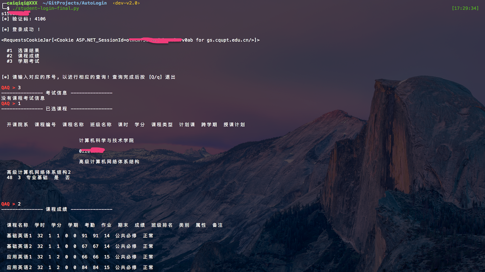

# 学校研究生管理系统的自动登录
YouTube地址：https://www.youtube.com/watch?v=K4LTgzm9G3w </br>
秒拍视频：http://weibo.com/p/230444427857313e89770690bec69367024c29 </br>

## Demo


## 用法
### 配置登录帐号密码
在登录脚本所在目录配置`config.ini`  格式为: </br>
```
[info]
username = XXXXX
password = XXXXX
```

- `pytesseract` 用于识别验证码
- `requests` 用于HTTP请求并维持session
- `bs4.BeautifulSoup` 用于解析html

## 关于__VIEWSTATE
> 
asp.net巧妙的改变了这一点. 当我们在写一个asp.net表单时, 一旦标明了 form runat=server ,那么,asp.net就会自动在输出时给页面添加一个隐藏域

 ```<input type="hidden" name="__VIEWSTATE" value="">```

 那么,有了这个隐藏域,页面里其他所有的控件的状态,包括页面本身的一些状态都会保存到这个控件值里面. 每次页面提交时一起提交到后台,asp.net对其中的值进行解码,然后输出时再根据这个值来恢复各个控件的状态. 我们再看这个控件的value值,它可能类似如下的形式:Oz4+O2w8aTwxPjs+O2w8.... 
 很多人会认为这是加密的信息,其实不是, ms仅仅是给各个控件和页面的状态存入适当的对象里面,然后把该对象序列化, 最后再做一次base64编码,直接赋值给viewstate控件.


参考：
http://www.cnblogs.com/yzxchoice/archive/2006/09/08/498499.html

## TODO
用lxml或者正则加速解析
